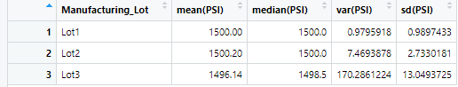
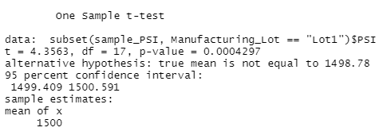
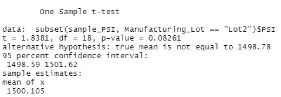
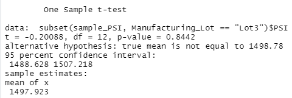

# MechaCar_Statistical_Analysis
----------------------------------------------------------------------------------

## Overview of the Statistical Analysis 
Perform retrospective analysis on historical data, analytical verification of current automotive specifications and study desgin of future auto testing.  

## Data Sources and Coding File
Data for analysis was provided in two csv files ([MPG](MechaCar_mpg.csv) and [Suspension](Suspension_Coil.csv)).  

Statistical analysis was performed in R and is [attached](MechaCarChallenge.R).  

## Linear Regression to Predict MPG

Performed a multiple linear regression to determine the effect of the following 5 measured varialbles on fuel efficiency (measured in mpg): vehicle length, vehicle weight, spoiler angle, ground clearance and drive train (AWD or not).  

The best-fit model is described by the following:  MPG = 6.267*vehicle_length + 0.001245*vehicle_weight +0.06887*spoiler_angle 3.546*ground_clearance - 3.411*AWD - 104.

Analyzing the model's coefficients (inputs), we find that vehicle length and ground clearance have a statistically significant impact on fuel economy (MPG).  Therefore, with this knowledge, we know the slope of the model is not zero because the individual contributors to the model's slope (6.267*vehicle_length and 3.546*ground_clearance) are significant and non-zero.  

Although, the analysis with 5 predictors does predict fuel economy fairly well (r-squared = 0.7149), it appears the model is not complete.  It is likely that other unmeasured predictors (variables) contribute to fuel economy as well.  

## Summary Statistics on Suspension Coils

The design specifications for the MechaCar suspension coils dictate that the variance of the suspension coils must not exceed 100 pounds per square inch. Does the current manufacturing data meet this design specification for all manufacturing lots in total and each lot individually? Why or why not?

text

## T-Tests on Suspension Coils

text

text

text

text

## Study Design: MechaCar vs Competition
briefly summarize your interpretation and findings for the t-test results. Include screenshots of the t-test to support your summary.
