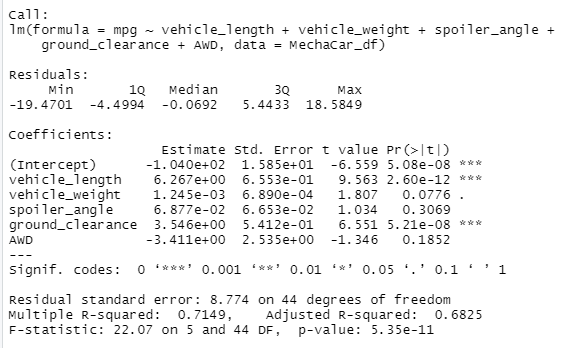
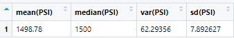
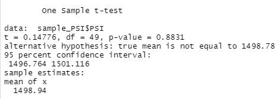

# MechaCar_Statistical_Analysis
----------------------------------------------------------------------------------

## Overview of the Statistical Analysis 
Perform retrospective analysis on historical data, analytical verification of current automotive specifications and study desgin of future auto testing.  

## Data Sources and Coding File
Data for analysis was provided in two csv files ([MPG](MechaCar_mpg.csv) and [Suspension](Suspension_Coil.csv)).  

Statistical analysis was performed in R and is [attached](MechaCarChallenge.R).  

## Linear Regression to Predict MPG

Which variables/coefficients provided a non-random amount of variance to the mpg values in the dataset?
Is the slope of the linear model considered to be zero? Why or why not?
Does this linear model predict mpg of MechaCar prototypes effectively? Why or why not?

## Summary Statistics on Suspension Coils

The design specifications for the MechaCar suspension coils dictate that the variance of the suspension coils must not exceed 100 pounds per square inch. Does the current manufacturing data meet this design specification for all manufacturing lots in total and each lot individually? Why or why not?

[Fig_3](MechaCar_Statistical_Analysis/Screenshots/Suspension_by_Lot.PNG)

text

## T-Tests on Suspension Coils

text

[Fig_5](MechaCar_Statistical_Analysis/Screenshots/ttest_PSI_Lot1.PNG)

text

[Fig_6](MechaCar_Statistical_Analysis/Screenshots/ttest_PSI_Lot2.PNG)

text

[Fig_7](MechaCar_Statistical_Analysis/Screenshots/ttest_PSI_Lot3.PNG)

text

## Study Design: MechaCar vs Competition
briefly summarize your interpretation and findings for the t-test results. Include screenshots of the t-test to support your summary.

